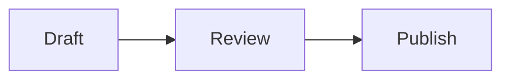
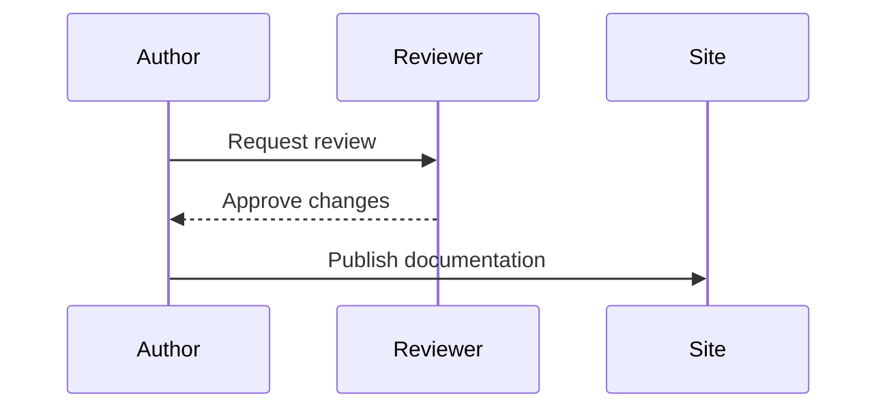

Mermaid diagrams render directly from Markdown in docs and blog posts. Select
**Expand** to open a larger view, then use **+**, **−**, and **Reset** to explore.
Scroll to move around a zoomed diagram. Press **Escape** or **Close** to return
to the page.

## Add a diagram

Use a fenced code block with the language `mermaid`:

````markdown

````


Include `accTitle` and `accDescr` to describe the diagram for assistive technology.
Diagrams follow the site's light and dark modes. Mermaid also supports sequence
diagrams, state diagrams, and other diagram types:



## Add a zoomable image

Use a normal Markdown image with descriptive alternative text. Click the image,
or focus it with Tab and press Enter, to zoom in. Image zoom uses
`docusaurus-plugin-image-zoom`, powered by Medium Zoom. Click again, press Escape,
or scroll to close it. The overlay follows the site's light and dark modes.

```markdown

```


Linked images keep their existing destination. Decorative images with empty
alternative text are not zoomable. To disable zoom for an individual image in
MDX, add `className="no-zoom"` to its image element.

The plugin selects images inside `.markdown` content, including images in docs
and blog posts. Standalone HTML files keep their original behavior. Custom React
images outside `.markdown` are not selected unless you expand the selector.

## Customize the presentation

Edit Mermaid settings under `themeConfig.mermaid` in `docusaurus.config.ts`.
Configure image selection, overlay colors, and zoom margins under
`themeConfig.zoom` in the same file. The `.theme-diagram`, `.theme-media-viewer`,
and `.medium-zoom-*` rules in `src/css/custom.css` style the diagram frame,
diagram viewer, and image overlay.
See [Customize the UI theme](./customize-theme.md) for the shared colors and fonts.
